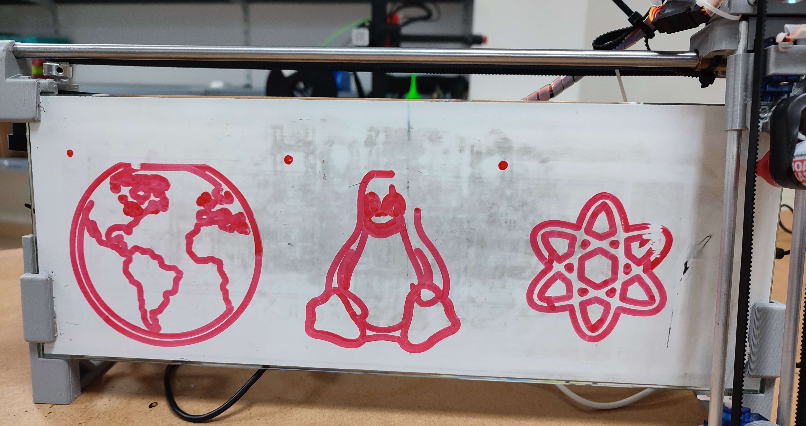

# IBoardBot API

Recreated IBoardBot API in Rust.



# How to run it

[Manual setup](./docs/Setup-Manual.md)

[Docker setup (recommended)](./docs/Setup-Docker.md)

[Reconfiguring the board](./docs/Flash-Arduino.md)

# Adding fonts

The `./fonts` directory is used to draw text on the board. You can specify which `ttf` font to use on the JSON request. It will use a default one if no font is specified.

# Board Configuration

The first time that a board connects to the API a configuration file for that board will be created under `./boards`. If you named your board `main`, the configuration file will be `./boards/main.yaml`

In this file you can specify the board dimensions (size). Ive found that for the board that is shown on the images, `3500` (width) X `1000` (height) works fine.

# API Docs

You can find the API docs at the `/docs` endpoint in the API.

# Frontend / Easy to use app

At the moment the only real way to use it is sending HTTP requests to the API, which you can find the docs on the `/docs` endpoint. 

I'm working on an easy to use frontend so be patient for that. 

## Quick CURL Example

Here's how you can write a text or draw an svg with curl

Replace **boardId** with watever you've named your board, for example `main` like so it ends up like `http://0.0.0.0/boards/main/jobs` (so remove the {} too).

Change `0.0.0.0` for the IP and port of your API.

### Text

```sh
$ curl -X POST \
  -H "Content-Type: application/json" \
  -d '{ "WriteText": { "text": "Hello" } }' \ # Replace "Hello" with the text that you want to draw
  http://0.0.0.0/boards/{boardId}/jobs
```

### SVG

```sh
$ curl -X POST \
  -H "Content-Type: application/json" \
  -d '{ "DrawSVG": { "Url": "https://www.svgrepo.com/download/13695/star.svg" }' \
  http://0.0.0.0/boards/{boardId}/jobs
```

### Erase

The board will remember what parts are occupied so you'll need to send an *erase* command so it can draw everywhere again. Note that this doesn't actually use the eraser to erase the board, you'll need to erase the board with your human hands for now.

```sh
$ curl -X POST \
  -H "Content-Type: application/json" \
  -d 'Erase' \
  http://0.0.0.0/boards/{boardId}/jobs
```