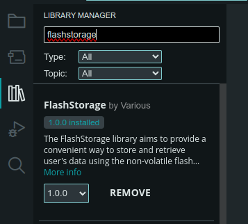

# Reflashing Arduino

We need to flash the [newer firmware](../firmware/iBoardBot_114_M0/) since the original one has a non functional configuration web panel and has their API url hardcoded.

## Requisites

- [Arduino IDE v2](https://docs.arduino.cc/software/ide-v2/tutorials/getting-started/ide-v2-downloading-and-installing/)

## Cloning the repository

First step is to clone this git repository

```sh
$ git clone https://github.com/Stay1444/iboardbot
```

## Opening the Arduino sketch

Open the file `/firmware/iBoardBot_114_M0/iBoardBot_114_M0.ino` with the Arduino IDE.

## Selecting the board

On the board selector, if not detected automatically, you need to select the Arduino Zero. This firmware is for the Arduino Zero variant of the iBoardBot, if you have the older Arduino Leonardo version you are out of luck.

## Installing the libraries

Open the library browser in the Arduino IDE and download the library called `FlashStorage`.



## Flashing & Configuring

Connect your board and press the `Upload` button. Once it's uploaded it should print to the serial this, at a baud rate of 115200.

```
Wifi Configuration mode...

Instructions:
->Connect to iBoardBot wifi network, password: 87654321
->Open page: http://192.168.4.1
->Fill SSID and PASSWORD of your Wifi network and press SEND!
```

Use a laptop or phone to connect to the WiFi Network called `iBoardBot`, then browse to `http://192.168.4.1` and configure the board as you want.

